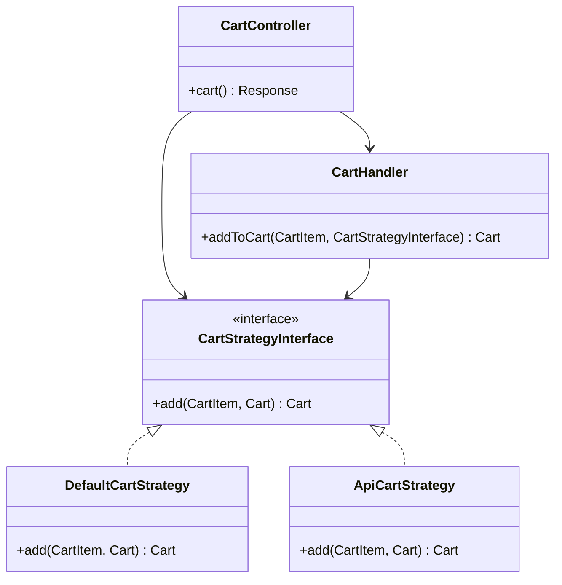
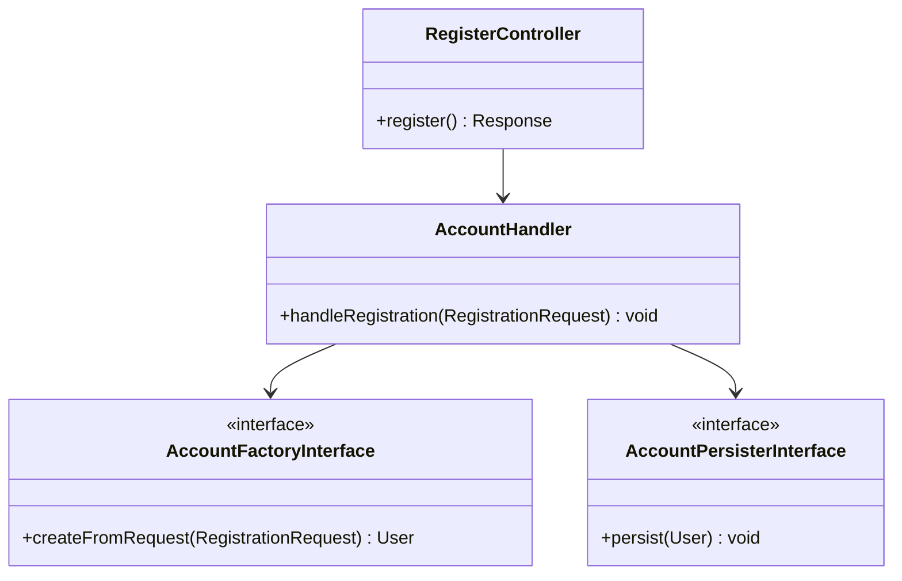

# 🎓 Projet E-Commerce 2026 - Symfony

Bienvenue dans mon projet E-Commerce final pour le module Symfony. 

Ce projet a été conçu non seulement pour répondre aux exigences fonctionnelles des TPs (Étape 1 à 4), mais surtout pour démontrer une maîtrise avancée de l'architecture logicielle, des principes **SOLID**, et des bonnes pratiques d'ingénierie enseignées en cours.

---

## 🎯 Récapitulatif des Étapes Réalisées

- ✅ **Étape 1 & 2 :** Intégration complète des templates HTML, création des entités `Product` et `Category` via Doctrine ORM, et dynamisation des pages (Accueil, Catégories, Détails).
- ✅ **Étape 3 :** Implémentation du panier en session en respectant rigoureusement le pattern **Strategy**. L'architecture a été pensée pour être extensible (ajout d'un stub `ApiCartStrategy`).
- ✅ **Étape 4 :** Sécurisation de l'application via `form_login`, hachage des mots de passe, formulaires d'inscription (avec `RepeatedType`), et protection de l'espace Profil.

---

## 🏗️ Architecture & Qualité du Code (Ce qui fait la différence)

Afin d'obtenir un code maintenable et professionnel, j'ai implémenté les patterns suivants à travers tout le projet :

### 1. `declare(strict_types=1)` & `final readonly`
Chaque fichier PHP du projet commence par `declare(strict_types=1)`. De plus, tous les services métier (Handlers, Fetchers, Persisters) sont déclarés comme `final readonly class` pour garantir l'immutabilité et empêcher l'héritage non désiré.

### 2. Contrôleurs Fins (Thin Controllers)
Les contrôleurs (ex: `CartController`, `ProductController`, `RegisterController`) ne contiennent **aucune logique métier**. Leur seul rôle est de recevoir la requête, de la mapper sur un DTO, et de déléguer l'exécution à un **Handler**.

### 3. Utilisation Systématique des DTOs
Les formulaires ne sont **jamais** liés directement aux entités Doctrine. J'ai créé des objets de transfert (ex: `RegistrationRequest`, `Pagination`) pour protéger l'application contre les failles d'assignation de masse (Mass Assignment) et pour transporter la donnée proprement.

### 4. Validation Avancée (Custom Constraints)
Le système de validation utilise les composants avancés de Symfony :
- **Contraintes Composées (Compound)** : `#[RequiredField]` combine `NotNull`, `NotBlank` et `Type('string')` pour éviter la répétition de code (DRY).
- **Validateurs Personnalisés** : `#[PasswordField]` vérifie la complexité des mots de passe côté serveur avec son propre `PasswordFieldValidator`.

### 5. Arguments Nommés (PHP 8)
Dans les FormBuilders, l'utilisation des arguments nommés (ex: `$builder->add(child: 'email', type: EmailType::class)`) garantit un code beaucoup plus lisible.

---

## 🧩 Patterns de Conception Utilisés

### Le Pattern "Interface → Strategy → Handler" (Module Panier)
Le module Panier a été conçu exactement selon le schéma architectural vu en cours :


*(L'injection de dépendances est gérée via `config/services.yaml` pour lier `CartStrategyInterface` à `DefaultCartStrategy`).*

### Le Pattern "Factory / Persister" (Module Compte)
Le flux d'inscription est orchestré par un `AccountHandler` qui coordonne une `Factory` (pour hasher le mot de passe et hydrater l'entité User) et un `Persister` (pour isoler la logique de l'EntityManager).



---

## ⚡ Optimisations Doctrine (N+1 Query Problem)

Pour éviter les problèmes de requêtes N+1 lors de l'affichage des produits et de leurs catégories, des requêtes personnalisées utilisant le `QueryBuilder` et des `JOIN FETCH` ont été ajoutées dans les repositories (ex: `findAllWithCategoryPaginated()`).

## 🛠️ Installation & Lancement

1. Cloner le repository
2. Lancer `composer install`
3. Configurer `.env` pour la base de données (déjà configuré par défaut pour un MySQL local sur le port 3306).
4. Créer la base de données et charger les données de test :
```bash
php bin/console doctrine:database:create
php bin/console doctrine:migrations:migrate
php bin/console doctrine:fixtures:load
```
5. Lancer le serveur local :
```bash
symfony server:start
# ou
php -S 127.0.0.1:8000 -t public
```

---
*Merci d'avoir pris le temps de consulter mon code !*
