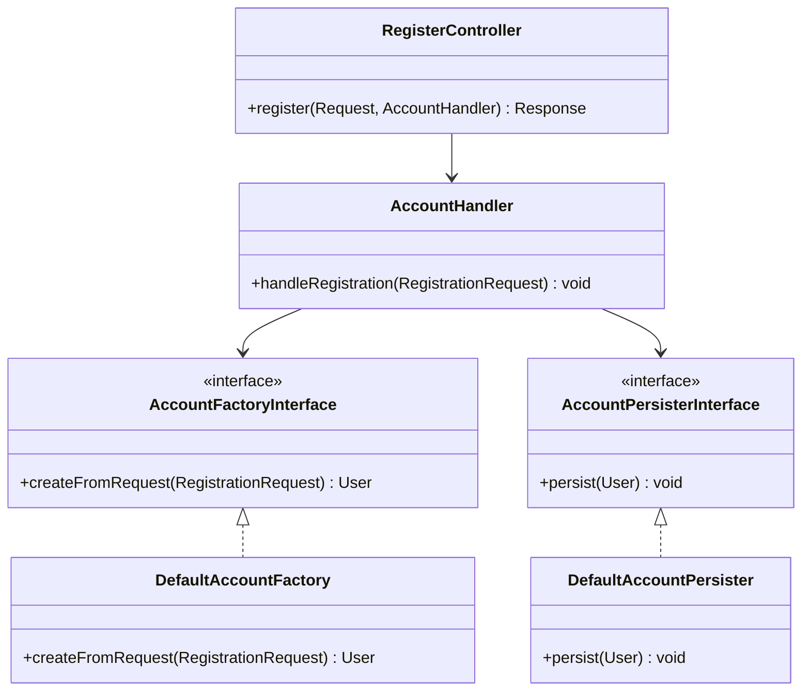
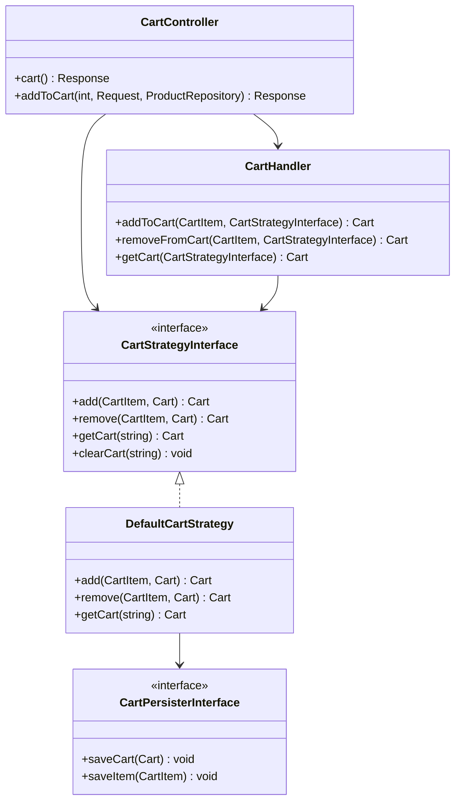

# Symfony E-Commerce Architecture Overview

This project implements a clean, SOLID-compliant architecture designed around the **Interface → Strategy → Handler** pattern.

## Core Architectural Principles

- **Strict Typing:** `declare(strict_types=1)` is used in all PHP files.
- **Service Immutability:** Services are declared as `final readonly` to prevent inheritance and ensure state immutability.
- **Dependency Inversion:** Controllers depend on Handlers and Fetchers, which in turn depend on Interfaces, not concrete implementations.
- **DTO Validation:** Data Transfer Objects (DTOs) are used for handling requests, with custom validation constraints.

## Account Module Architecture

The `Account` module handles user registration using a Factory and Persister strategy orchestrated by a Handler.

## Cart Module Architecture

The `Cart` module delegates persistence and business logic to strategies, allowing for seamless switching between Session-based, API-based, or Database-backed carts.

